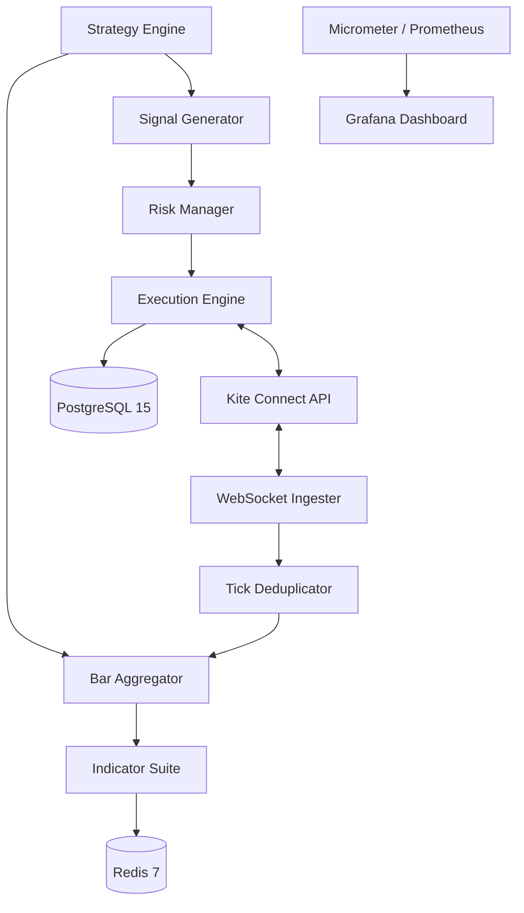

# 🚀 Algo Trading Platform (NSE / Zerodha Kite Connect)

[](https://jdk.java.net/21/)
[](https://spring.io/projects/spring-boot)
[](#performance)

A production-grade, multi-strategy algorithmic trading system integrated with **Zerodha's Kite Connect API (v3)**. Optimized for intraday and options strategies on the National Stock Exchange (NSE) with a hard focus on low-latency execution and rigid risk management.

---

## 🏗️ Architecture

The system is architected as a **Modular Monolith**, ensuring low internal latency while maintaining high maintainability.



## ⚡ Key Features

- **P99 Signal-to-Order Latency ≤ 300ms**: Optimized using Java 21 Virtual Threads and low-overhead internal routing.
- **WebSocket Ingestion & Deduplication**: Real-time tick ingestion with `(instrument_token, timestamp)` deduplication via bounded LRU cache.
- **Multi-Strategy Support**: Dynamic YAML configuration for strategy loading (`EMACrossover`, `ShortStraddle`, etc.).
- **Greeks Approximation**: Native Black-Scholes implementation for real-time Options Delta, Gamma, Theta, and Vega.
- **Write-Ahead Order Logging**: All order intents are persisted to PostgreSQL before API submission to ensure consistency.
- **Self-Healing Reconciliation**: Automatically reconciles `AMO_PENDING` and `OPEN` orders with the broker on startup.
- **Backtesting Harness**: 2-year historical simulation with accurate fill modeling (next-bar open + slippage).

---

## 🛠️ Tech Stack

- **Core**: Java 21, Spring Boot 3.2.x
- **Storage**: PostgreSQL 15 (Order State), Redis 7 (Market Data Cache)
- **Integration**: OkHttp 4 (REST), Java-WebSocket (Ticks)
- **Monitoring**: Micrometer, Prometheus, Grafana
- **Reliability**: Resilience4J (Exponential Backoff + Jitter)

---

## 🚀 Getting Started

### Prerequisites

- Docker & Docker Compose
- Java 21 SDK
- Zerodha Kite Connect API Key & Secret

### 1. Configure Strategies
Modify `strategies.yml` to define your trading parameters:

```yaml
strategies:
  - id: ema_crossover_nifty
    class: EMACrossoverStrategy
    instruments: [NIFTY50]
    timeframe: 5m
    warmup_bars: 26
    risk:
      max_risk_per_trade_pct: 1.0
      stop_loss_pct: 1.5
```

### 2. Launch Infrastructure
```bash
docker-compose up -d
```

### 3. Build & Run
```bash
./gradlew bootRun
```

---

## 📊 Monitoring

The platform exposes a comprehensive Grafana dashboard (found in `grafana-dashboard.json`) tracking:
- **P99 Signal-to-Order Latency**
- **Profit & Loss (PnL / MTM)**
- **Daily Portfolio Kill Switch Status**
- **Greeks Exposure (for Options strategies)**

Access the Prometheus metrics at `localhost:8080/actuator/prometheus`.

---

## ⚖️ Risk Management

- **Fixed-Fractional Sizing**: Position sizes are calculated dynamically based on `% of capital at risk` and `stop distance`.
- **Kill Switch**: Automatic hard liquidation at 5% daily portfolio loss.
- **Auto Square-off**: Hard exit of all MIS positions at **15:10 IST** to beat NSE auto-square-off charges.

---

## 📜 License
Privately Licensed. All rights reserved.
